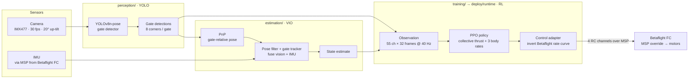

# AI Grand Prix

**An autonomous drone-racing stack: a deep-RL flight policy trained in Isaac Lab, fed by a custom YOLO gate detector and a vision–inertial state estimate, deployed on an NVIDIA Jetson Orin NX.** Built for the AI Grand Prix physical qualifier (Anduril LC3, Santa Ana, September 2026) by a Cornell University team.

This repository consolidates three subsystems — simulation/training, perception, and the onboard flight client — into one project, with the full git history of each preserved.

<!-- DEMO GIF -->
<p align="center">
  
</p>
<p align="center"><em>The 40 Hz racing policy from the competition pad, up and through gate 1 (Isaac Sim).</em></p>

> **TODO — demo video:** swap this in for on-aircraft / higher-quality flight footage from the perception repo once available. More clips live in [`docs/paper/videos/`](docs/paper/videos) (`race_best.mp4`, `race_start_from_pad.mp4`, `stack_run_01–03.mp4`) and GIFs in [`docs/paper/figures/`](docs/paper/figures) (`race_best.gif`, `stack_pov.gif`).

---

## Architecture

The onboard data flow, camera to motors, all running on the Jetson Orin NX:



A rendered system diagram from the paper is at [`docs/paper/figures/system_diagram.png`](docs/paper/figures/system_diagram.png).

---

## Repository layout

| Path | Subsystem | Contents |
|---|---|---|
| [`training/`](training) | **Simulation & RL training** | Isaac Sim / Isaac Lab / skrl PPO stack: race & hover tasks, plant/dynamics, observation contract, drone + gate assets, test suite, the trained checkpoints. |
| [`perception/`](perception) | **Gate detection (YOLO)** | Fine-tuned YOLOv8n-pose gate-corner detector, `GateDetector` library + CLI, the training notebook, and shipped weights. |
| [`estimation/`](estimation) | **Vision–inertial estimation** | Gate PnP, pose filter and gate tracker that fuse detections with IMU into a state estimate. |
| [`deploy/`](deploy) | **Jetson Orin runtime** | `runtime/` closed-loop flight client, `target/` camera + MSP/IMU link + provisioning, `orin-setup/` bench scripts. |
| [`tools/`](tools) | **Bench & analysis** | Flight recorders, telemetry decode, analysis utilities, `download_models.sh`. |
| [`docs/`](docs) | **Docs & media** | `paper/` (figures, GIFs, videos), `reference/` (competition spec + Orin guides), `campaign/` (on-site engineering docs). |

---

## Subsystems

### Training — Isaac Lab RL  ·  [`training/`](training)
An Isaac Sim / Isaac Lab / skrl PPO stack that trains a policy to fly the organizer's ten-gate hall course from projected gate corners plus IMU, and to hover in front of a gate. The policy emits four numbers — collective thrust and three body rates — at 40 Hz.

- Tasks: `training/tasks/drone_racer`, `training/tasks/drone_hover`.
- Train / play / diagnose: `training/scripts/rl/`.
- Trained keepers: `training/checkpoints/` (`race40`, `race40drop`).


### Perception — YOLO gate detector  ·  [`perception/`](perception)
A fine-tuned YOLOv8n-pose model that detects racing gates and localises their 8 corners (4 outer + 4 inner) so the stack can aim through the opening. Keypoint order: `out_UL, out_UR, out_BR, out_BL, in_UL, in_UR, in_BR, in_BL`.

- Library + CLI: `perception/inference.py` (`GateDetector`).
- Weights: `perception/models/` (`best.pt`, `gate_pose_hand497.pt`/`.onnx`).
- **Quantization status:** an ONNX export is provided (`*.onnx`); INT8/TensorRT quantization for the Orin is **TODO** (a `perception/quantization/` home is planned).


### Estimation — VIO  ·  [`estimation/`](estimation)
Fuses the YOLO gate detections with the IMU into a state estimate: `pnp.py` recovers gate-relative pose, `pose_filter.py` and `gate_tracker.py` filter and track it across frames, and `observation.py` assembles the policy input.

### Deploy — Jetson Orin runtime  ·  [`deploy/`](deploy)
The onboard racing client and target tooling that ran on the aircraft's Jetson Orin NX.

- `deploy/runtime/` — the closed loop: guidance/controller, policy runtime, and the control adapter that inverts Betaflight's rate curve and streams four RC channels over MSP override.
- `deploy/target/` — camera calibration, the MSP library and IMU/motor tools, provisioning scripts.
- `deploy/orin-setup/` — connection, motor and hover bench scripts.


---

## Quickstart

### Training (Isaac Lab)
Requires **NVIDIA Isaac Sim 4.5.0 + Isaac Lab** (install per the [Isaac Lab docs](https://isaac-sim.github.io/IsaacLab/) — these provide Python, torch and gymnasium).

```bash
# inside the Isaac Lab Python environment
python -m pip install -e training/
pip install -r requirements-training.txt

# train the racing policy
python training/scripts/rl/train.py --task drone_racer

# play a checkpoint
python training/scripts/rl/play.py --task drone_racer --checkpoint training/checkpoints/race40drop_best_agent.pt

# tests (env/PhysX tests skip automatically without Isaac)
cd training && python -m pytest -q
```

### Perception
```bash
# a CUDA build of torch first for real-time inference — see perception/requirements.txt
pip install -r perception/requirements.txt

python perception/inference.py --source img.jpg --show          # image
python perception/inference.py --source flight.mp4 --save out.mp4 # video
python perception/inference.py --source 0 --show                 # webcam
```

### Deployment (Jetson Orin NX)
```bash
# on the Orin (JetPack); prefer apt builds of OpenCV + PyGObject
pip install -r requirements-deploy.txt

# provisioning, camera bind, MSP/IMU checks
bash deploy/target/provision.sh
# props-off handover and runners: see deploy/runtime/README.md
```

> ⚠️ **Safety:** never open the Betaflight CLI on the flight controller, and never exit a runner while the override switch is on — the FC holds the last MSP command. See `docs/campaign/` for the on-site rules.

### Large assets (not in git)
Model weights are versioned in-tree. The Isaac USD assets (git-LFS pointers), the Roboflow dataset, and flight bags are fetched separately:
```bash
bash tools/download_models.sh        # set the TODO Release URLs in the script first
# or, for the USD assets, if you have the LFS remote:  git lfs pull
```

---

## Results

> No numbers are filled in here on purpose — every benchmark must be reproduced and reported against the exact hardware it ran on. Measured results from the qualifier and simulation are written up in the paper: [`docs/paper/paper.md`](docs/paper/paper.md) / [`paper.pdf`](docs/paper/paper.pdf).

| Benchmark | Hardware | Result |
|---|---|---|
| Racing policy — gates / episode (perfect corners) | TODO (e.g. training box GPU) | TODO |
| Racing policy — gates / episode (measured corner dropout) | TODO | TODO |
| Hover — % settled within 0.30 m | TODO | TODO |
| Full training run — wall-clock / cost | TODO (GPU, # envs) | TODO |
| YOLO gate detector — latency / frame | TODO (Jetson Orin NX vs desktop GPU vs CPU) | TODO |
| YOLO gate detector — detection accuracy | TODO | TODO |
| MSP link — round-trip latency | Jetson Orin NX ↔ Betaflight FC (115200 baud) | TODO |
| End-to-end onboard loop — rate achieved | Jetson Orin NX | TODO |

---

## Team

A Cornell University team. Contributors to this repository, from git history:

| Contributor | Focus |
|---|---|
| **Bojro Das** | Isaac Lab simulator & PPO training, deploy runtime, bench tools, paper |
| **Etienne Sasenarine** | YOLO gate-pose perception; repository owner |
| **Geneustace Wicaksono** | Training/estimation contributions, reference material |

Full team roster (per the source repositories): Geneustace Wicaksono, Bojro Das, Etienne Sasenarine, John Apessos, Grant Lin, Narayan Topalli, and Aaron Legg.

**Attributions.** The Isaac Lab simulator descends from Kousheek Chakraborty's `isaac_drone_racer` (BSD-3-Clause). The MSP library and camera toolchain under `deploy/target/` are the competition organizers'.

## License

See [`training/LICENSE`](training/LICENSE) (BSD-3-Clause, inherited from the simulator). Other subsystems follow the same license unless a subdirectory states otherwise.
