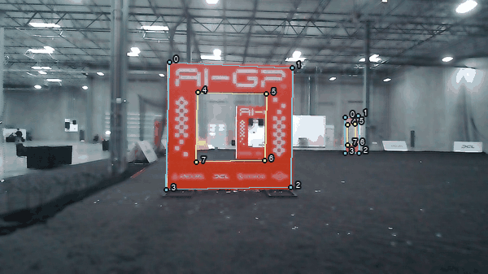
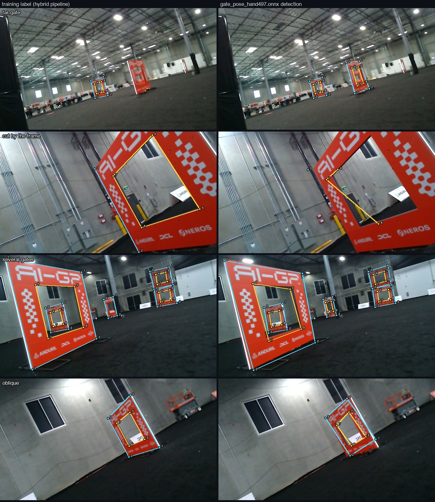
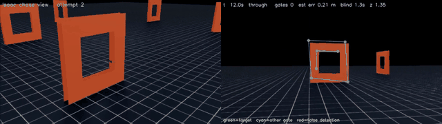
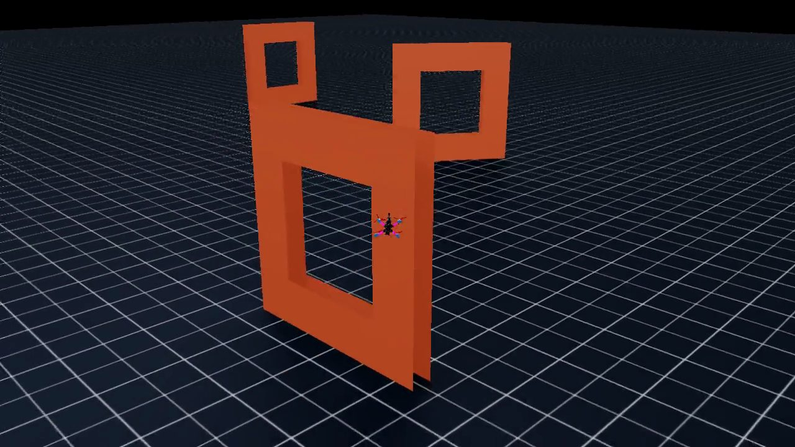
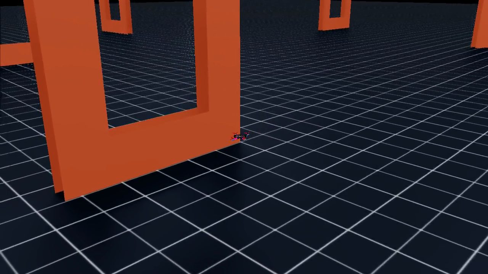
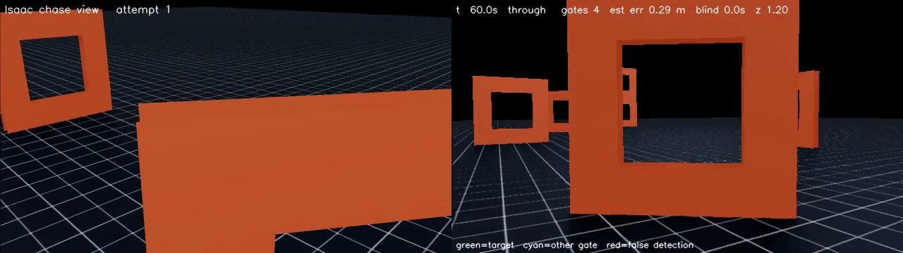
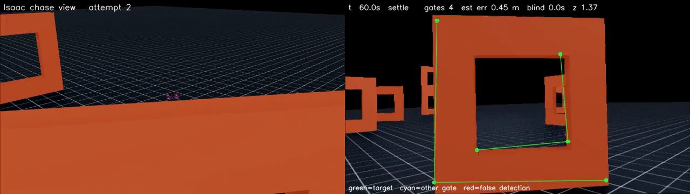
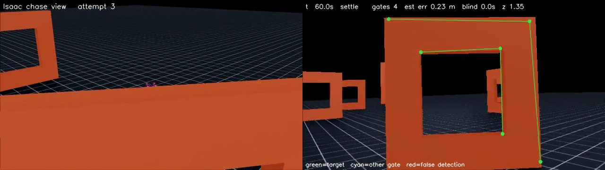
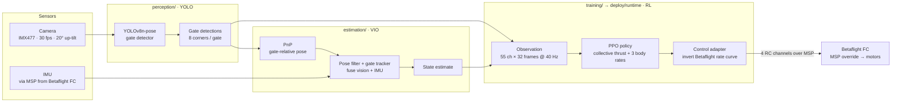
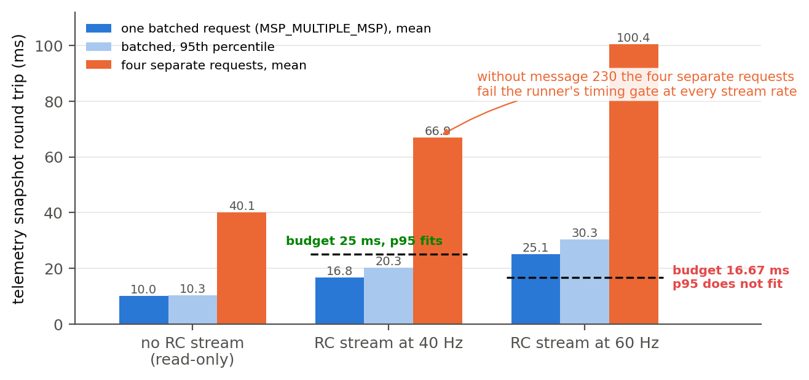

# AI Grand Prix

**An autonomous drone-racing stack built for the Anduril AI Grand Prix physical qualifier**. A deep-RL flight policy trained in Isaac Lab flies through gates that a YOLO pose model finds in the camera image, using a vision–inertial state estimate, all running onboard an NVIDIA Jetson Orin NX.

This repository brings the three subsystems (simulation and training, perception, and the onboard flight client) into one project, with the full git history of each preserved. The whole effort is written up in [the paper](docs/paper/paper.md) ([PDF](docs/paper/paper.pdf)).

<p align="center">
  
</p>
<p align="center"><em>The 40 Hz racing policy lifting off the competition pad and flying through gate 1 (Isaac Sim).</em></p>

---

## Contents

- [In action](#in-action)
- [Architecture](#architecture)
- [Repository layout](#repository-layout)
- [Subsystems](#subsystems)
- [Quickstart](#quickstart)
- [License](#license)

---

## On Drone

### Gate detection on real camera frames

<p align="center">
  
</p>
<p align="center"><em><code>gate_pose_hand497</code>, the shipped detector, as the camera walks up to a gate and through it. The corners stay on the gate and keep their IDs until they leave the frame, and it picks up the gates behind along the way. Cyan marks the outer ring and yellow marks the opening.</em></p>

<p align="center">
  
</p>
<p align="center"><em>The same model as the camera swings around a gate and closes on it. The eight corners keep their IDs through the turn, which the pose solve depends on.</em></p>

These are raw frames from the aircraft's own camera, run through the same detector class the flight code uses. Corners below the 0.25 keypoint-confidence threshold are left out, so each frame shows exactly what the aircraft would receive.

<p align="center">
  
</p>
<p align="center"><em>Four hard cases, each shown as its training label (left) and the detector's output (right): far gates, a gate cut off by the frame edge, five gates at once, and an oblique view.</em></p>

### Full stack in simulation

<p align="center">
  
</p>
<p align="center"><em>The classical fallback stack in Isaac: chase view (left) and the drone's own camera with the simulated detector's corners (right).</em></p>

### Videos

Click a thumbnail to open the full recording.

| | | |
|:---:|:---:|:---:|
| [](docs/paper/videos/race_start_from_pad.mp4) | [](docs/paper/videos/race_best.mp4) | [](docs/paper/videos/stack_run_01.mp4) |
| **Race from the pad.** The 40 Hz policy takes off and passes gate 1 (6.7 s). | **Early chase-cam run.** A pre-fix checkpoint that doesn't finish the course (9.9 s). | **Fallback stack, run 1.** Chase view plus onboard camera (60 s). |
| [](docs/paper/videos/stack_run_02.mp4) | [](docs/paper/videos/stack_run_03.mp4) | |
| **Fallback stack, run 2** (60 s) | **Fallback stack, run 3** (60 s) | |

---

## Architecture

The onboard data flow, from camera to motors, all on the Jetson Orin NX:



The paper's rendered system diagram is at [`docs/paper/figures/system_diagram.png`](docs/paper/figures/system_diagram.png).

---

## Repository layout

| Path | Subsystem | Contents |
|---|---|---|
| [`training/`](training) | **Simulation & RL training** | Isaac Sim / Isaac Lab / skrl PPO stack: race and hover tasks, plant/dynamics, observation contract, drone and gate assets, tests, trained checkpoints. |
| [`perception/`](perception) | **Gate detection (YOLO)** | Fine-tuned YOLOv8n-pose gate-corner detector, `GateDetector` library + CLI, training notebook, shipped weights. |
| [`estimation/`](estimation) | **Vision–inertial estimation** | Gate PnP, pose filter and gate tracker that fuse detections with the IMU into a state estimate. |
| [`deploy/`](deploy) | **Jetson Orin runtime** | `runtime/` closed-loop flight client, `target/` camera + MSP/IMU link + provisioning, `orin-setup/` bench scripts. |
| [`tools/`](tools) | **Bench & analysis** | Flight recorders, telemetry decoding, analysis utilities, `download_models.sh`. |
| [`docs/`](docs) | **Docs & media** | `paper/` (write-up, figures, videos), `perception/` (detector media), `reference/` (competition spec + Orin guides), `campaign/` (on-site engineering docs). |

---

## Subsystems

### Training: Isaac Lab RL · [`training/`](training)

An Isaac Sim / Isaac Lab / skrl PPO stack that trains a policy to fly the organizers' ten-gate hall course from projected gate corners plus IMU data, and to hover in front of a gate. The policy outputs four numbers at 40 Hz: collective thrust and three body rates.

- **Tasks:** `training/tasks/drone_racer`, `training/tasks/drone_hover`
- **Train / play / diagnose:** `training/scripts/rl/`
- **Trained checkpoints:** `training/checkpoints/` (`race40`, `race40drop`)


### Perception: YOLO gate detector · [`perception/`](perception)

A fine-tuned YOLOv8n-pose model that detects racing gates and localizes their 8 corners (4 outer, 4 inner) so the stack can aim through the opening.

```
0 ───────────── 1        out_UL out_UR out_BR out_BL   ids 0 1 2 3
│  4 ───── 5  │          in_UL  in_UR  in_BR  in_BL    ids 4 5 6 7
│  │       │  │
│  7 ───── 6  │
3 ───────────── 2
```

The gate is a square annulus with a 2700 mm outer boundary and a 1500 mm flyable opening. Each ring's corners are numbered clockwise from the top-left.

- **Library + CLI:** `perception/inference.py` (`GateDetector`)
- **Weights:** `perception/models/` (`best.pt`, `gate_pose_hand497.pt` / `.onnx`)
- **Quantization:** ONNX export is done. INT8/TensorRT for the Orin is still to do; the plan is in [`perception/quantization/`](perception/quantization).

The labelling pipeline, dataset tooling and training/eval scripts behind these weights live in the separate [`bojro/aigp-perception`](https://github.com/bojro/aigp-perception) repository.


### Estimation: VIO · [`estimation/`](estimation)

Fuses YOLO gate detections with the IMU into a state estimate. `pnp.py` recovers gate-relative pose, `pose_filter.py` and `gate_tracker.py` filter and track it across frames, and `observation.py` assembles the policy input.

### Deploy: Jetson Orin runtime · [`deploy/`](deploy)

The onboard racing client and target tooling that ran on the aircraft's Jetson Orin NX.

- **`deploy/runtime/`:** the closed loop, made up of the guidance/controller, the policy runtime, and a control adapter that inverts Betaflight's rate curve and streams four RC channels over MSP override.
- **`deploy/target/`:** camera calibration, the MSP library, IMU/motor tools and provisioning scripts.
- **`deploy/orin-setup/`:** connection, motor and hover bench scripts.



---

## Quickstart

### Training (Isaac Lab)

Requires **NVIDIA Isaac Sim 4.5.0 + Isaac Lab**. Install them following the [Isaac Lab docs](https://isaac-sim.github.io/IsaacLab/); they provide Python, torch and gymnasium.

```bash
# inside the Isaac Lab Python environment
python -m pip install -e training/
pip install -r requirements-training.txt

# train the racing policy
python training/scripts/rl/train.py --task drone_racer

# play a checkpoint
python training/scripts/rl/play.py --task drone_racer --checkpoint training/checkpoints/race40drop_best_agent.pt

# tests (env/PhysX tests are skipped automatically when Isaac isn't installed)
cd training && python -m pytest -q
```

### Perception

```bash
# install a CUDA build of torch first for real-time inference (see perception/requirements.txt)
pip install -r perception/requirements.txt

python perception/inference.py --source img.jpg --show            # image
python perception/inference.py --source flight.mp4 --save out.mp4 # video
python perception/inference.py --source 0 --show                  # webcam
```

### Deployment (Jetson Orin NX)

```bash
# on the Orin (JetPack); prefer the apt builds of OpenCV and PyGObject
pip install -r requirements-deploy.txt

# provisioning, camera bind, MSP/IMU checks
bash deploy/target/provision.sh
# props-off handover and runners: see deploy/runtime/README.md
```

> [!WARNING]
> Never open the Betaflight CLI on the flight controller. Never exit a runner while the override switch is on, because the FC keeps holding the last MSP command. See `docs/campaign/` for the full on-site rules.

### Large assets (not in git)

Model weights are versioned in the repo. The Isaac USD assets (git-LFS pointers), the Roboflow dataset and the flight bags are fetched separately:

```bash
bash tools/download_models.sh   # fill in the Release URLs in the script first
git lfs pull                    # USD assets, if you have access to the LFS remote
```

---

## License

See [`training/LICENSE`](training/LICENSE) (BSD-3-Clause, inherited from the simulator). The other subsystems use the same license unless a subdirectory says otherwise.

The Isaac Lab simulator is derived from Kousheek Chakraborty's [`isaac_drone_racer`](https://github.com/kousheekc/isaac_drone_racer) (BSD-3-Clause). The MSP library and camera toolchain under `deploy/target/` come from the competition organizers.
